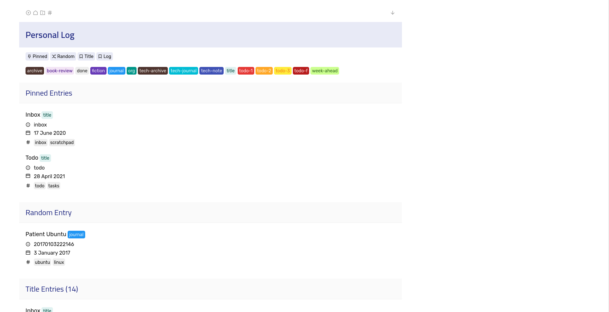

# Personal Log Theme for Hugo



## Hugo Site Config

Make sure the below configuration parameters are set in `config.yaml`. They are required for the theme to work properly.

```yaml
title: <site-title>
theme: hugo-theme-log
params:
  content_dir: "<path-to-content-directory>"
pygmentsUseClasses: true
markup:
  goldmark:
    extensions:
      definitionList: true
      footnote: true
      linkify: true
      strikethrough: true
      table: true
      taskList: true
      typographer: true
    parser:
      attribute:
        block: false
        title: true
      autoHeadingID: true
      autoHeadingIDType: github
    renderer:
      hardWraps: true
      unsafe: true
      xhtml: false  
  highlight:
    anchorLineNos: false
    codeFences: true
    guessSyntax: false
    hl_Lines: 
    lineAnchors: 
    lineNoStart: 1
    lineNos: false
    lineNumbersInTable: true
    noClasses: true
    style: 
    tabWidth: 4
related:
  includeNewer: true
  indices:
  - name: tags
    weight: 100
  - name: date
    weight: 10
  threshold: 80
  toLower: false
taxonomies:
  tag: tags
  type: types
```

