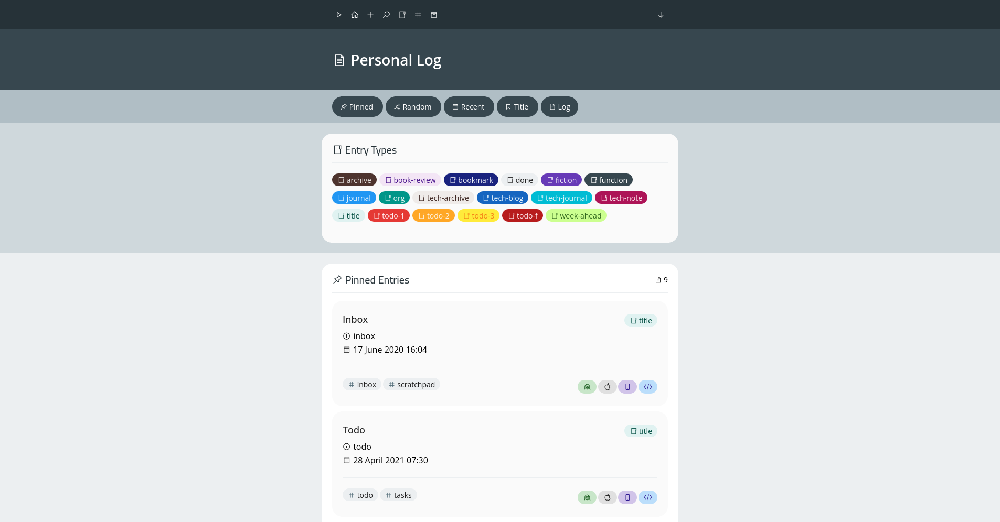

# Personal Log Theme for Hugo

A theme for my personal log/knowledge-base/wiki/digital-garden that I have created from scratch. 

I think it's visually nice, but the HTML/CSS is currently a rushed mess. 

Bare in mind that the theme is designed and created for a very specific Hugo use-case (my personal knowledge system), so it won't work out of the box on a normal Hugo site.

## Screenshot



## Hugo Site Config

Make sure the below configuration parameters are set in `config.yaml`. They are required for the theme to work properly.

```yaml
title: <site-title>
theme: hugo-theme-log
params:
    start_page: "<full-path-to-start-page>"
    root_dir: "<path-to-content-directory>"
    obsidian_vault: "<obsidian-vault-name>"
pygmentsUseClasses: true
markup:
    goldmark:
        extensions:
            definitionList: true
            footnote: true
            linkify: true
            strikethrough: true
            table: true
            taskList: true
            typographer: true
        parser:
            attribute:
                block: false
                title: true
            autoHeadingID: true
            autoHeadingIDType: github
        renderer:
            hardWraps: true
            unsafe: true
            xhtml: false
    highlight:
        anchorLineNos: false
        codeFences: true
        guessSyntax: false
        hl_Lines:
        lineAnchors:
        lineNoStart: 1
        lineNos: false
        lineNumbersInTable: true
        noClasses: true
        style:
        tabWidth: 4
related:
    includeNewer: true
    indices:
        - name: tags
          weight: 100
        - name: date
          weight: 10
    threshold: 80
    toLower: false
taxonomies:
    tag: tags
    type: types
```
